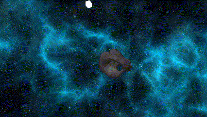
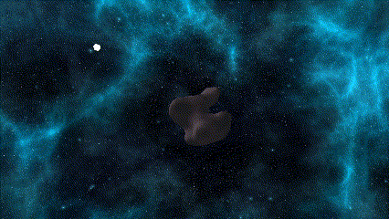

-----Overview-----

This application procedurally generates asteroids using OpenGL. I have designed and coded my own implementation of the marching cubes algorithm, which I used together with Open Simplex Noise to generate random 3d meshes and continuous 3d textures.

Examples:

Controls:

	ESC - Exit

	0 - Reset view
	Arrow Keys - Look around

	;/' - Rotate light around
	,/. - Decrease/increase light height
	</> - Decrease/increase light radius

	d/D - Decrease/increase dimensions (rate of sampling noise, options are [5, 10, 15, 25, 50])
	s/S - Decrease/increase scale (Note: higher dimensions generally work better with lower scale, and visa versa)
	t/T - Decrease/increase threshold (see Marching Cubes below)
	i - Toggle interpolation (see Interpolation below)
	v - Toggle vignette (see Vignette below)
	o - Toggle changing offset for noise (morhping mesh)
	x - Toggle texture
	Space - Swap between mesh and point array (Note: doing this at high dimensions makes the program run very slowly)

Notes:
I disabled the changing offset for the higher dimensions as generating meshes at high dimensions takes a long time and can cause the program to be unresponsive. In general be aware that the higher dimensions can take a long time to generate a mesh, and a new mesh is generated everytime any of the parameters are changed.

-----Details-----

Open Simplex Noise:
This is a noise function for creating continuous 2D, 3D, and 4D noise. I used already existing code for this, found at https://github.com/deerel/OpenSimplexNoise.

Marching Cubes:
This is an algorithm that allows you to take a 3d array of points of varying values, and turn them into a 3D mesh. If a point has a value above a certain threshold, it is inside the mesh, otherwise it is outside the mesh. It is called marching cubes because it works by looking at each cube (8 points) individually, then creating a few triangles for that specific cube. After marching through all the cubes, you are left with a continuous 3D mesh. My implementation is in PointArray.cpp in the function updateAsteroid().

triTable:
To know what triangles to place based on which points of the cube are above the threshold, a triangle table is used. I didn't generate my own table, I grabbed and modified an exisiting one found here: http://paulbourke.net/geometry/polygonise/.

Interpolation:
Without interpolation, when one point is inside the mesh and an adjacent point is outside the mesh, a vertex is created halfway between the two points. However, this leads to very blocky looking meshes; intersting stylistically, but not good for creating smooth meshes. To avoid this, you need to place the vertex where the threshold falls between the two points. For exmaple: point 1 has a value of 0.1, point 2 has a value of 0.5, and the threshold is 0.4. Without interpolation, we would place the vertex halfway from point 1 to point 2, but with interpolation, we place the vertex three quarters of the way to point 2.

Vignette:
By default, we just sample the noise at each point to get it's value, but this doesn't create good meshes. Since it is a random cubic snapshot of noise, there is no guarantee that the mesh will be watertight as it ends very suddenly at the edges of where we are sampling. To avoid this, I did some processing on the noise, creating a kind of 3D vignette effect. All the points on the edge of our point array will always be outside the mesh, which guarantees that the mesh will be watertight. However, now the mesh simply looks like 3D noise trapped in a box, with large smooth faces at the edges of sampling. To avoid that, I made it so the closer a point is to the edge, the less likely it is to be inside the mesh. This results in much more natural looking meshes.
